# BDMV folder to burnable ISO

This guide shows how to turn a BDMV disc folder into a BD-ROM ISO that is safe to burn onto multi-layer media. It was written with tsMuxeR GUI 2.11.0; the screenshots show exactly what you see on screen.

## What this tab does

The `BDMV folder -> ISO` tab wraps an existing BDMV disc folder into a burnable BD-ROM ISO, byte for byte. BD-J menus and every stream are kept intact; nothing is re-muxed. On a multi-layer disc (dual-layer BD-R DL, or triple and quad-layer BD-R XL) the layer-break guard fills the defect-prone sectors at each layer transition with zeros, so the movie plays seamlessly across the break instead of landing on the worst sectors of the disc.

## Before you start

You need:

* a BDMV disc folder, that is a folder containing `BDMV` (and usually `CERTIFICATE`). It can be one you authored yourself or an already-readable disc copy.
* a blank disc in mind (BD-R DL, BD-RE DL or BD-R XL), so you can pick the right disc type.

## Step 1: open the tab

Start tsMuxeR GUI and switch to the `BDMV folder -> ISO` tab. The text at the top summarises what the tab does.

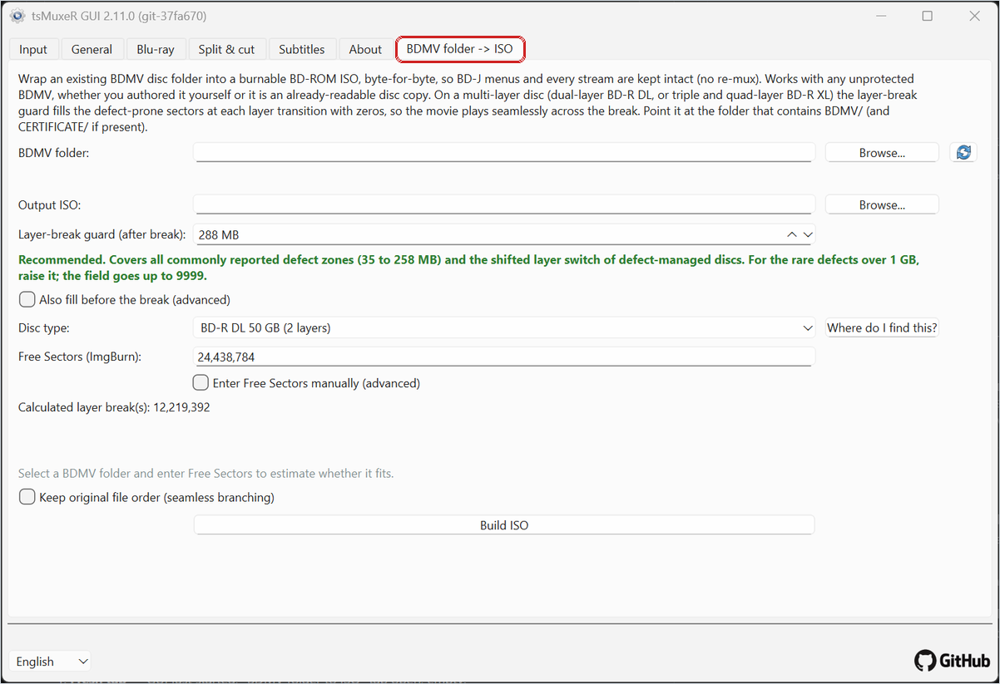

## Step 2: pick the disc folder

Click `Browse` next to `BDMV folder` and select the folder that **contains** `BDMV` and `CERTIFICATE`, not the `BDMV` folder itself.

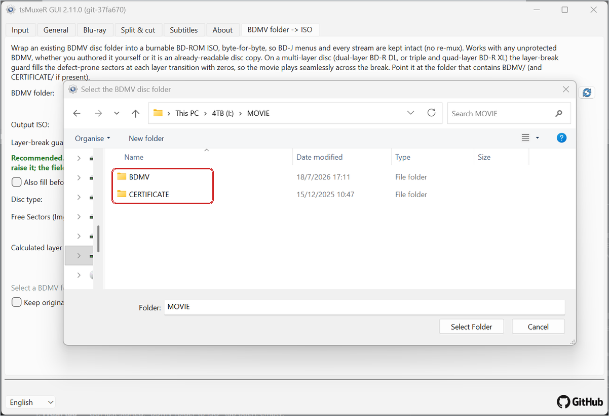

## Step 3: check the filled-in tab

After the folder is chosen, the tab fills itself in:

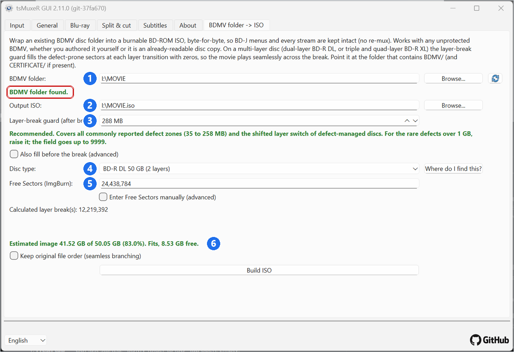

1. The chosen folder, confirmed by the green `BDMV folder found` message.
2. The output ISO. It is placed next to the source folder automatically; use `Browse` to change it.
3. The layer-break guard, preset to the recommended 288 MB (more on this below).
4. The disc type you plan to burn.
5. The Free Sectors of the blank disc and, below it, the calculated layer break position(s).
6. The fit estimate: how large the image will be, whether it fits on the chosen disc type, and how much room is left. The same line warns you if the content does not fit.

If everything looks right you can go straight to `Build ISO`. The remaining sections explain the individual settings.

## The disc type

Pick the disc you will actually burn. The choice sets the disc capacity and how many layer transitions need guarding: one break on a dual-layer disc, two on a triple-layer, three on a quad-layer.

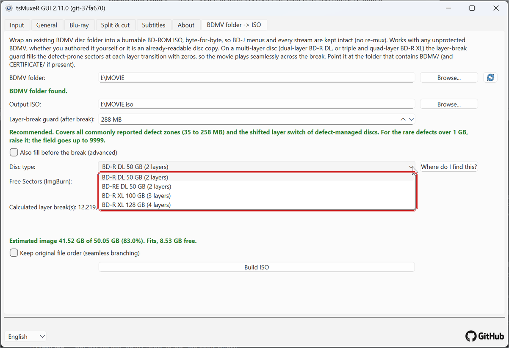

## Free Sectors

For a standard blank disc the field is filled in for you and stays locked. If your burning program reports a different value for your specific disc, tick `Enter Free Sectors manually (advanced)` and type that number; the calculated layer break updates immediately. The `Where do I find this?` button explains where ImgBurn shows the value.

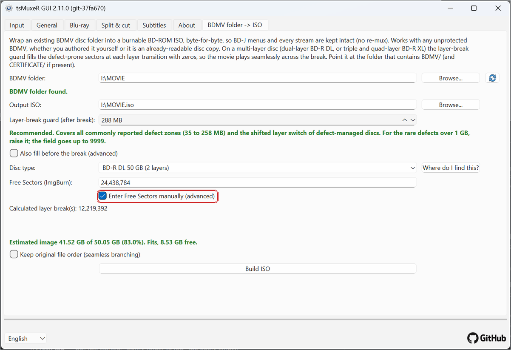

## The layer-break guard

The guard is the amount of zero fill placed after each layer break, so the layer transition does not land in the middle of your movie data. The default of 288 MB is the recommended value: it covers all commonly reported defect zones (35 to 258 MB) and the shifted layer switch of defect-managed discs.

You can lower it, but the hint under the field tells you what you give up. At 100 MB it turns amber: typical defects are covered, but not the larger bad zones seen on real media.

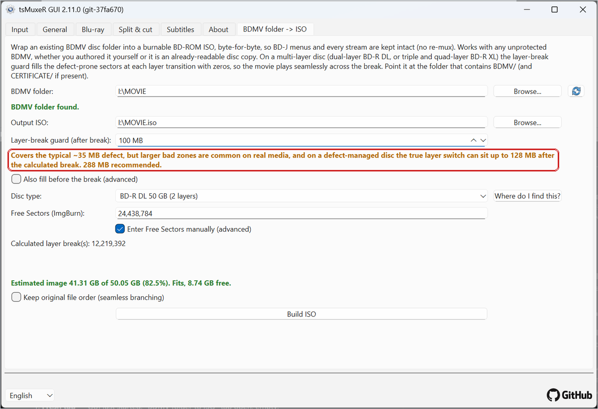

Below about 35 MB it turns red: video may land on sectors that are known to fail on real hardware.

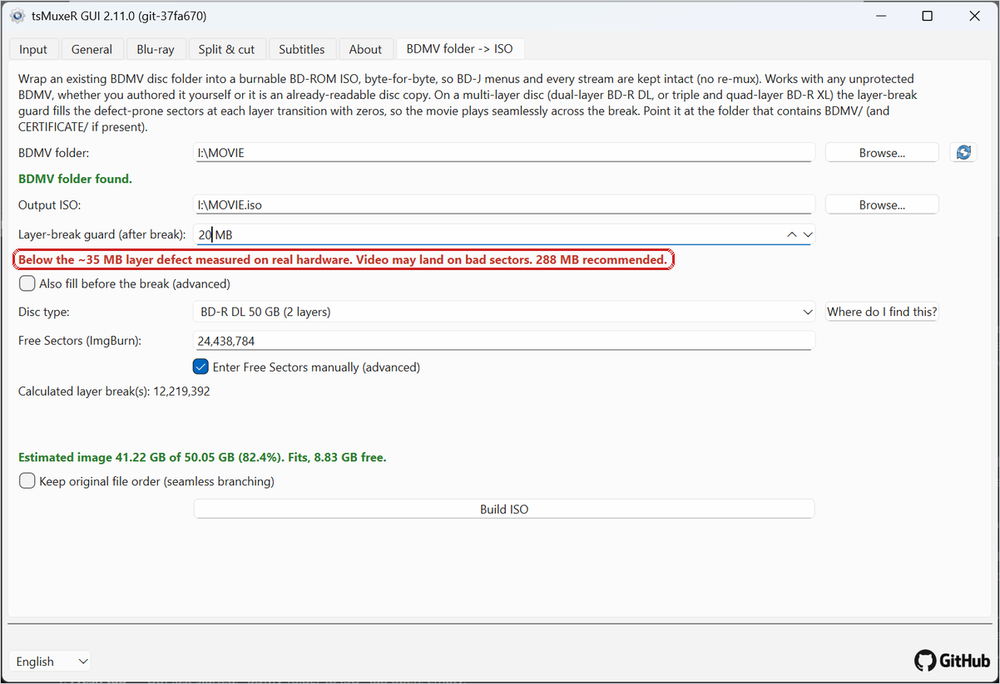

When in doubt, leave it at 288 MB. For the rare defects beyond 1 GB the field goes up to 9999.

## Advanced options

`Also fill before the break` adds a second, smaller guard in front of the break (default 4 MB). The standard guard is asymmetric on purpose, because most defects sit at the start of the next layer; turn this on only for media that also fail just before the break.

`Keep original file order (seamless branching)` prevents the files from being rearranged. Normally the largest file is placed first, which gives the guard the best position; if your disc relies on seamless branching, where the stream files must stay in their original order, tick this instead.

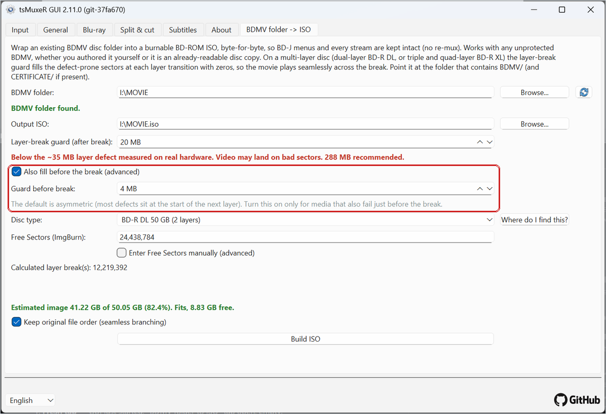

## A disc or mounted ISO as source

You can point the tab directly at a disc drive or a mounted ISO (here `J:`). The blue message reminds you that the source is read-only, so the output ISO is kept on a writable drive instead.

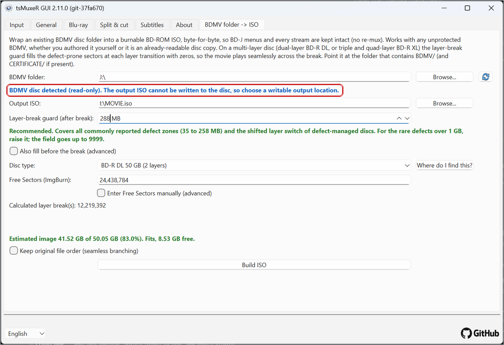

## Building

Click `Build ISO`. The progress window shows the percentage and the tsMuxeR log, including the guard settings being applied.

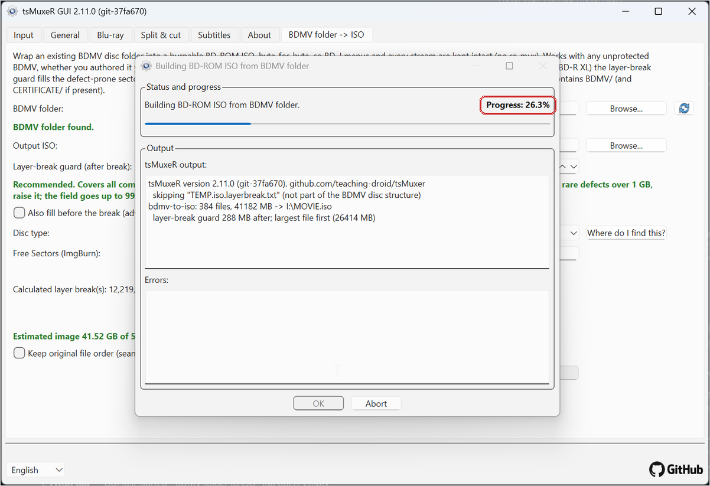

## Reading the final report

When the build finishes, the log ends with the layer-break report:

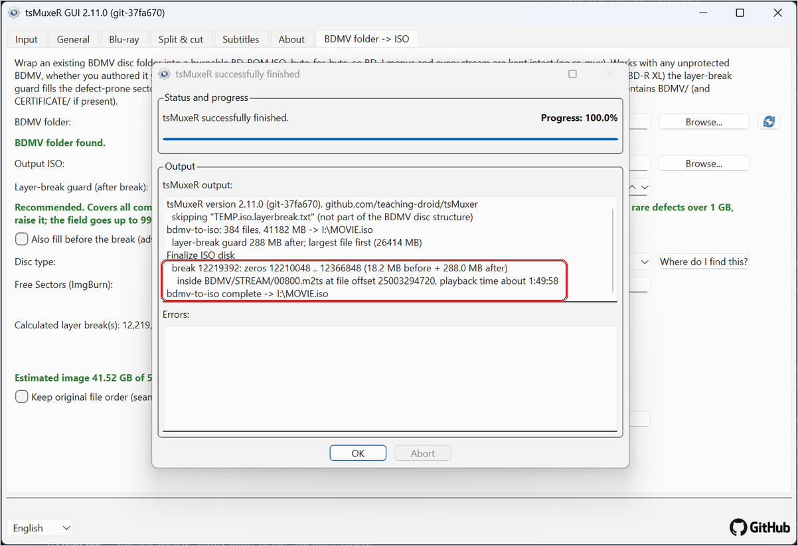

It tells you, for each break:

* the break sector and the exact range of zero fill around it,
* which stream file the break falls into, and
* the **playback time** of that spot, here about 1:49:58.

The playback time is the useful part: that is the moment the player crosses to the next layer. If you want to verify a burned disc, jump to that time and watch the transition; it should play through without a visible pause.

## The layerbreak text file

Next to the ISO a small text file is created, named after it, for example `MOVIE.iso.layerbreak.txt`. It contains the same layer-break report, so you can look up the break position and the playback time later without rebuilding anything. If you keep the ISO for future burns, keep the text file with it.

## Burning

Burn the ISO with your usual burning program (for example ImgBurn). No special settings are needed; the layer break was already placed and guarded inside the image. After burning, you can use the playback time from the report to check the layer transition on the finished disc.
