# BDMV folder to burnable ISO

This guide shows how to turn a BDMV disc folder into a BD-ROM ISO that is safe to burn onto multi-layer media. It was written with tsMuxeR GUI 2.11.0 and updated through 2.13; the screenshots show exactly what you see on screen.

## What this tab does

The `BDMV folder -> ISO` tab wraps an existing BDMV disc folder into a burnable BD-ROM ISO, byte for byte. BD-J menus and every stream are kept intact; nothing is re-muxed. On a multi-layer disc (dual-layer BD-R DL, or triple and quad-layer BD-R XL) the layer-break guard fills the defect-prone sectors at each layer transition with zeros, so the movie plays seamlessly across the break instead of landing on the worst sectors of the disc.

## Before you start

You need:

* a BDMV disc folder, that is a folder containing `BDMV` (and usually `CERTIFICATE`). It can be one you authored yourself or an already-readable disc copy.
* a blank disc in mind (BD-R DL, BD-RE DL or BD-R XL), so you can pick the right disc type.

## Step 1: open the tab

Start tsMuxeR GUI and switch to the `BDMV folder -> ISO` tab. The text at the top summarises what the tab does.

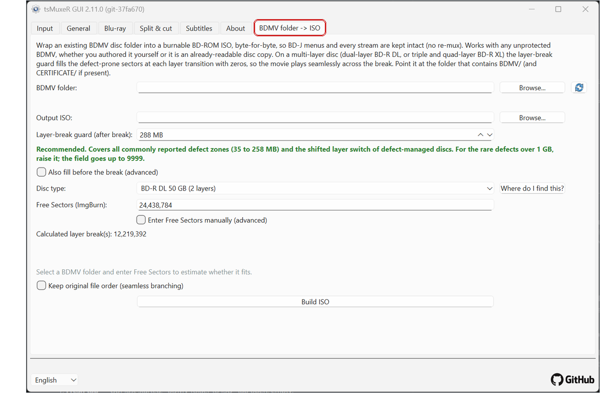

## Step 2: pick the disc folder

Click `Browse` next to `BDMV folder` and select the folder that **contains** `BDMV` and `CERTIFICATE`, not the `BDMV` folder itself.

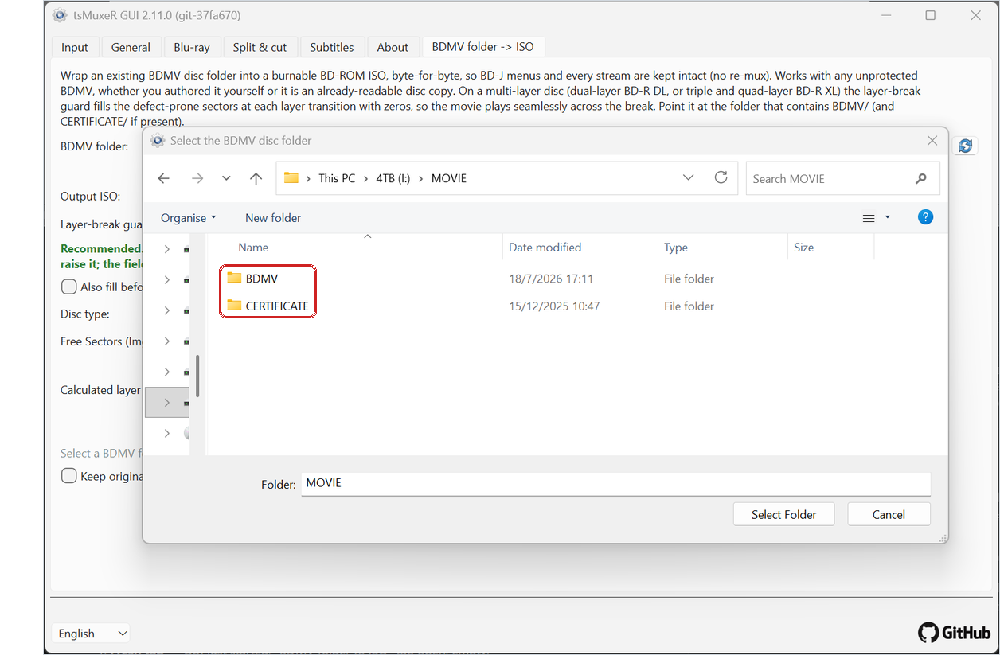

## Step 3: check the filled-in tab

After the folder is chosen, the tab fills itself in:

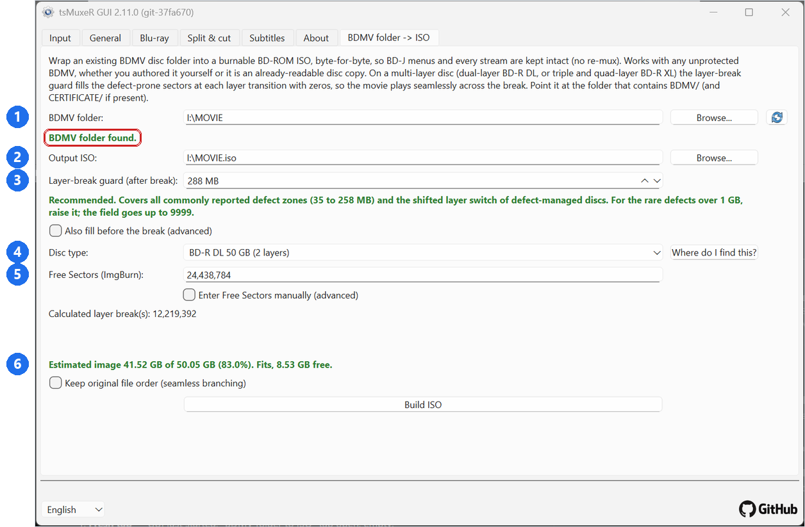

1. The chosen folder, confirmed by the green `BDMV folder found` message.
2. The output ISO. It is placed next to the source folder automatically; use `Browse` to change it.
3. The layer-break guard, preset to the recommended 288 MB (more on this below).
4. The disc type you plan to burn.
5. The Free Sectors of the blank disc and, below it, the calculated layer break position(s).
6. The fit estimate: how large the image will be, whether it fits on the chosen disc type, and how much room is left. The same line warns you if the content does not fit. As a rule of thumb, aim for about 90 percent or less (see "How full to make the disc" below).

If everything looks right you can go straight to `Build ISO`. The remaining sections explain the individual settings.

## The disc type

Pick the disc you will actually burn. The choice sets the disc capacity and how many layer transitions need guarding: one break on a dual-layer disc, two on a triple-layer, three on a quad-layer.

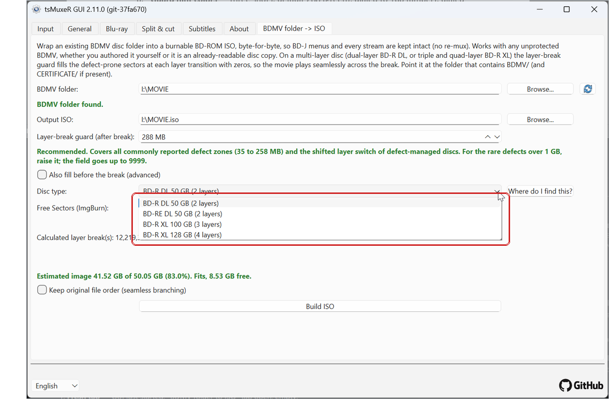

## Free Sectors

For a standard blank disc the field is filled in for you and stays locked. If your burning program reports a different value for your specific disc, tick `Enter Free Sectors manually (advanced)` and type that number; the calculated layer break updates immediately.

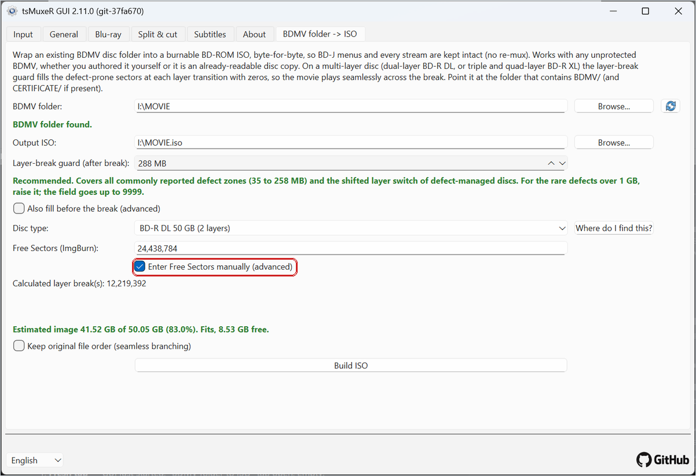

### Where to find the Free Sectors value in ImgBurn

**Note:** ImgBurn is independent third-party software and is not part of tsMuxeR, nor affiliated with, endorsed by, or maintained by this project. It is shown here only as a widely used example; any comparable burning tool that reports the disc's free sectors works just as well.

The `Where do I find this?` button next to the field opens this explanation. Open ImgBurn and choose **Write image file to disc**:

Put the blank disc in the drive. The disc information panel on the right lists **Free Sectors**; that is the number to enter:

Use the Free Sectors value itself, not Free Space (which is in bytes) or a sector count from another tool; only Free Sectors is the disc's full formatted capacity.

## How full to make the disc

Aim to fill the disc only to about 90 percent, not to the brim. Blank optical media are written from the inside outward, and the outermost sectors, written last and fastest, are where burn quality is weakest and read errors appear first. Keeping the burn to about 90 percent keeps your movie off that worst zone.

The fit estimate makes this easy to judge: in the example above the image fills 83 percent of the disc, comfortably under 90. If the estimate climbs past 90 percent, use the next larger disc type.

## The layer-break guard

The guard is the amount of zero fill placed after each layer break, so the layer transition does not land in the middle of your movie data. The default of 288 MB is the recommended value: it covers all commonly reported defect zones (35 to 258 MB) and the shifted layer switch of defect-managed discs.

You can lower it, but the hint under the field tells you what you give up. At 100 MB it turns amber: typical defects are covered, but not the larger bad zones seen on real media.

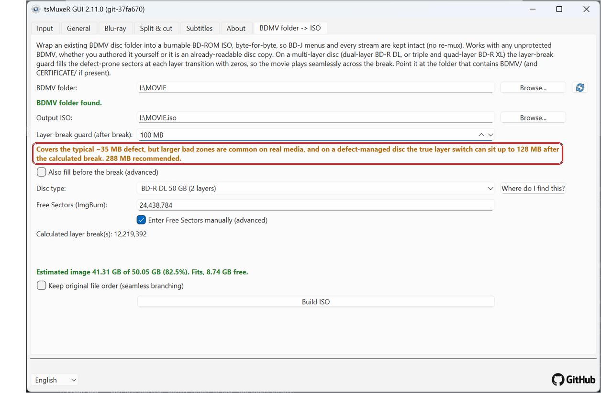

Below about 35 MB it turns red: video may land on sectors that are known to fail on real hardware.

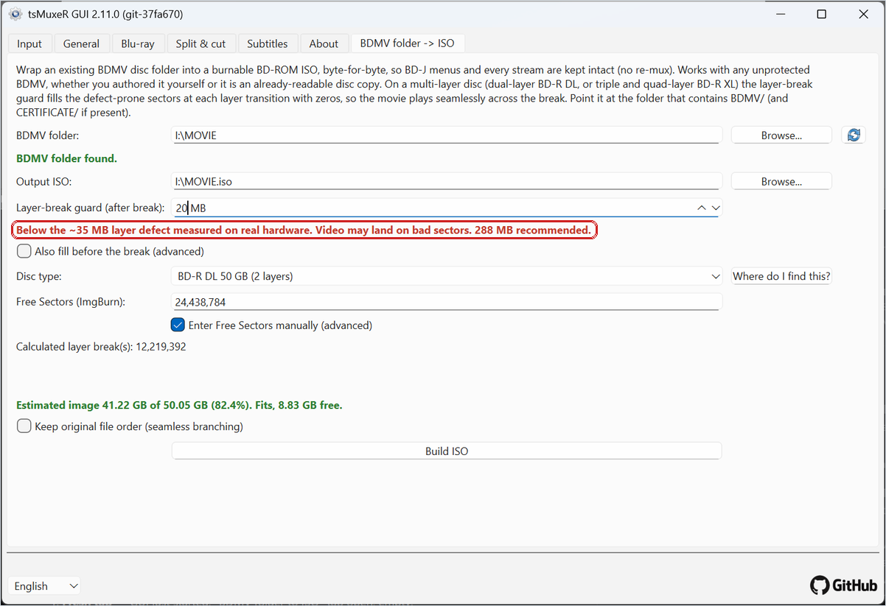

When in doubt, leave it at 288 MB. For the rare defects beyond 1 GB the field goes up to 9999.

## Keeping the movie off the outer edge (inner-only)

The outer rim of an optical disc is the hardest part to burn well: it is written last and fastest, and it is where read errors show up first. The `Keep data on the inner disc area (pad the outer edge)` checkbox packs the whole movie onto the inner tracks of every layer and fills the outer region with zeros, so nothing important lands on that weak outer edge.

When you tick it:

* tsMuxeR sizes the guard automatically from the disc type and the amount of content and pads the image out to the full disc, so the manual `Layer-break guard` field and the advanced `Also fill before the break` option grey out (both ringed above). There is nothing to set by hand.
* The movie still plays seamlessly across the layer break, exactly like the fixed guard; the zero fill simply moves to the outer edge instead of sitting in a band right after the break.

Use it when your priority is the most robust possible burn and you do not mind the image filling the whole disc. Leave it off if you would rather keep the image small and place a fixed guard yourself. It was verified on dual-layer BD-R DL: a disc that verified with a 41 MB uncorrectable defect right at the layer transition still played the movie flawlessly, because the defect fell inside the zero band. Requested by DreckSoft.

## Advanced options

`Also fill before the break` adds a second, smaller guard in front of the break (default 4 MB). The standard guard is asymmetric on purpose, because most defects sit at the start of the next layer; turn this on only for media that also fail just before the break.

`Keep original file order (seamless branching)` prevents the files from being rearranged. Normally the largest file is placed first, which gives the guard the best position; if your disc relies on seamless branching, where the stream files must stay in their original order, tick this instead.

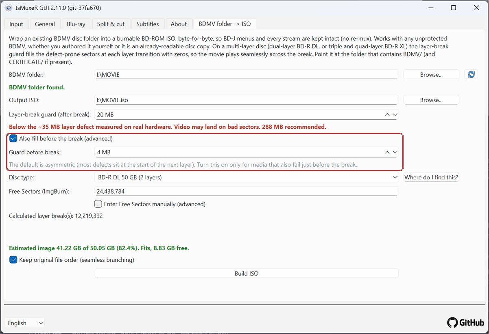

## Disc label and included files

Three more options sit at the bottom of the tab:

* `Disc label (optional)`: the volume label written into the ISO. Leave it empty to keep the previous behaviour.
* `Include all files from the folder (not just BDMV)`: by default the image holds the disc-structure folders (`BDMV`, `CERTIFICATE`, `AACS`). Tick this to also add every other file and folder next to `BDMV`, such as readme files or cover art.
* `3D disc: store the video once, not twice`: a 3D disc holds its video once under three names, the `.ssif` and the two `.m2ts` being the same sectors seen three ways. Copying all three by name writes it twice and roughly doubles the image, so a 3D disc taken from a BD50 no longer fits on one. Tick this to store it once, the way the source disc does. It has no effect on a 2D disc.

Either way, tsMuxeR completes the full standard Blu-ray folder layout for you: the empty `AUXDATA`, `BDJO`, `JAR` and `META` folders, a `CERTIFICATE` folder, and a `BACKUP` filled with copies of `index.bdmv`, `MovieObject.bdmv` and the `PLAYLIST`/`CLIPINF` files, the same structure tsMuxeR creates when it authors a disc. Only what the source is missing is added, and the large `.m2ts` streams are never duplicated, so players that expect the complete layout are satisfied without bloating the image.

## A disc or mounted ISO as source

You can point the tab directly at a disc drive or a mounted ISO (here `J:`). The blue message reminds you that the source is read-only, so the output ISO is kept on a writable drive instead.

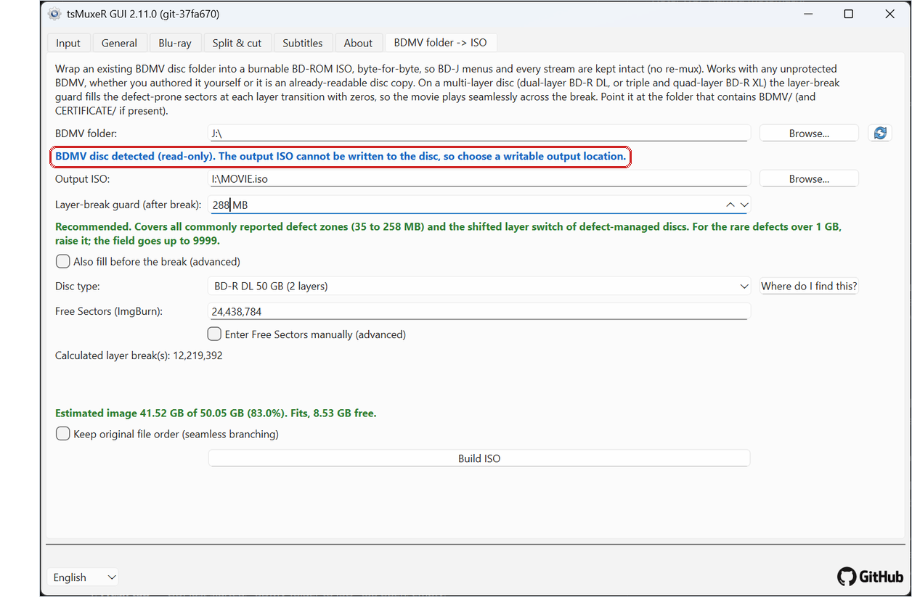

## Building

Click `Build ISO`. The progress window shows the percentage and the tsMuxeR log, including the guard settings being applied.

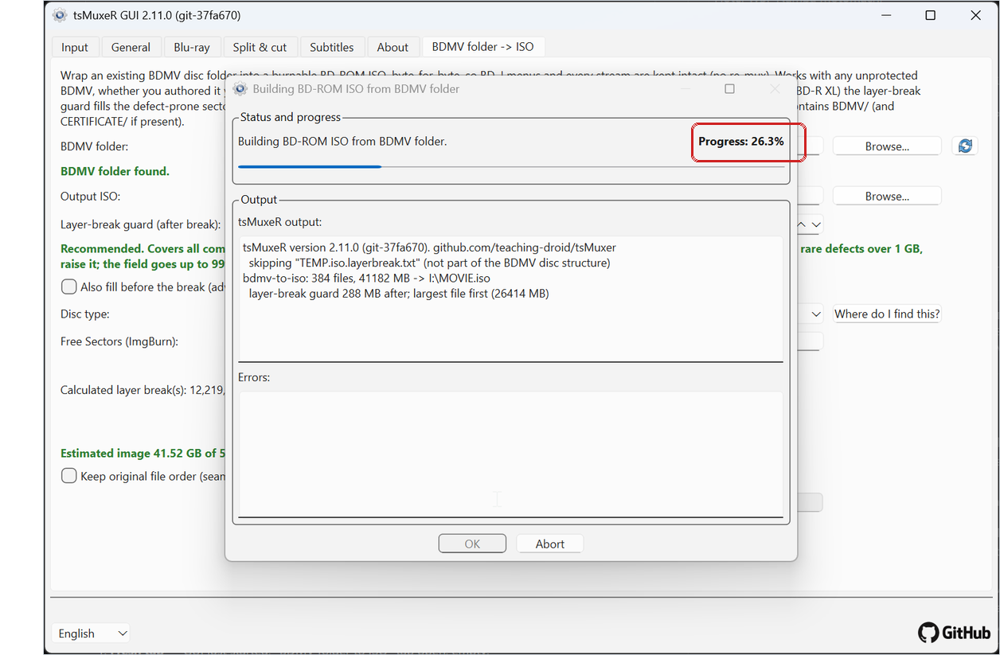

## Reading the final report

When the build finishes, the log ends with the layer-break report:

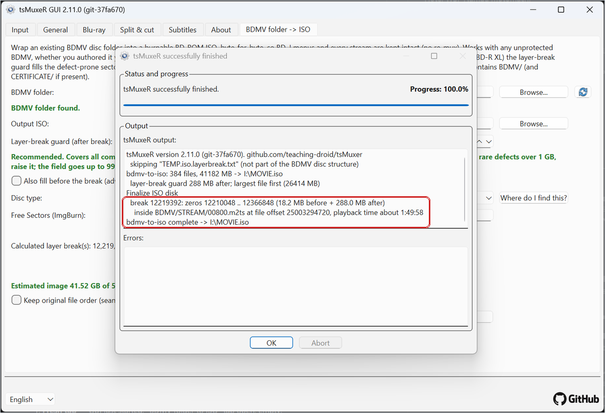

It tells you, for each break:

* the break sector and the exact range of zero fill around it,
* which stream file the break falls into, and
* the **playback time** of that spot, here about 1:49:58.

The playback time is the useful part: that is the moment the player crosses to the next layer. If you want to verify a burned disc, jump to that time and watch the transition; it should play through without a visible pause.

## The layerbreak text file

Next to the ISO a small text file is created, named after it, for example `MOVIE.iso.layerbreak.txt`. It contains the same layer-break report, so you can look up the break position and the playback time later without rebuilding anything. If you keep the ISO for future burns, keep the text file with it.

## How much disk space the ISO uses

The layer-break guard and the inner-only padding are stored as a sparse region: the zeros are recorded as an empty hole in the file instead of gigabytes of literal zero bytes on disk. So the `.iso` on your hard drive can be much smaller than the disc it represents; an inner-only image padded to a full 50 GB BD-R DL may take only about the size of the movie itself, because the whole outer-edge fill costs no disk space.

This changes nothing about the burn. When you write the ISO, the drive still lays down the complete disc, zeros and all, byte for byte identical to a non-sparse image, so the burn takes the full time for the disc size. The sparse file only saves room on your hard drive and lets the build finish sooner; it does not make the disc smaller or quicker to burn.

If you copy the ISO to a drive or filesystem that does not support sparse files, it expands to its full size there. That is normal, and the disc it produces is the same either way.

## Burning

Burn the ISO with your usual burning program (for example ImgBurn). No special settings are needed; the layer break was already placed and guarded inside the image. After burning, you can use the playback time from the report to check the layer transition on the finished disc.
