# BDMV-Ordner in eine brennbare ISO verwandeln

Diese Anleitung zeigt Schritt für Schritt, wie aus einem BDMV-Disc-Ordner eine BD-ROM-ISO wird, die sich gefahrlos auf mehrschichtige Medien brennen lässt. Sie entstand mit tsMuxeR GUI 2.11.0; die Bildschirmfotos zeigen genau das, was auch bei Ihnen zu sehen ist.

## Was dieser Reiter macht

Der Reiter `BDMV-Ordner -> ISO` verpackt einen vorhandenen BDMV-Disc-Ordner Byte für Byte in eine brennbare BD-ROM-ISO. BD-J-Menüs und alle Streams bleiben unverändert erhalten, es wird nichts neu gemuxt. Bei einer Disc mit mehreren Schichten (zweischichtige BD-R DL oder drei- und vierschichtige BD-R XL) füllt der Layer-Break-Schutz die fehleranfälligen Sektoren an jedem Schichtübergang mit Nullen. Der Film läuft dadurch nahtlos über den Umbruch hinweg, statt auf den schlechtesten Sektoren der Disc zu landen.

## Vorbereitung

Sie brauchen:

* einen BDMV-Disc-Ordner, also einen Ordner, der `BDMV` (und meistens `CERTIFICATE`) enthält. Er kann selbst erstellt oder die Kopie einer bereits lesbaren Disc sein.
* einen Rohling im Blick (BD-R DL, BD-RE DL oder BD-R XL), damit Sie den passenden Disc-Typ wählen können.

## Schritt 1: Reiter öffnen

Starten Sie die tsMuxeR GUI und wechseln Sie auf den Reiter `BDMV-Ordner -> ISO`. Der Text oben fasst zusammen, was der Reiter tut.

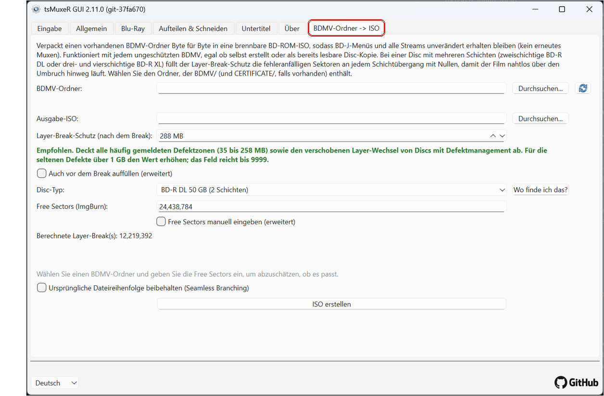

## Schritt 2: Disc-Ordner auswählen

Klicken Sie neben `BDMV-Ordner` auf `Durchsuchen` und wählen Sie den Ordner, der `BDMV` und `CERTIFICATE` **enthält**, nicht den Ordner `BDMV` selbst.

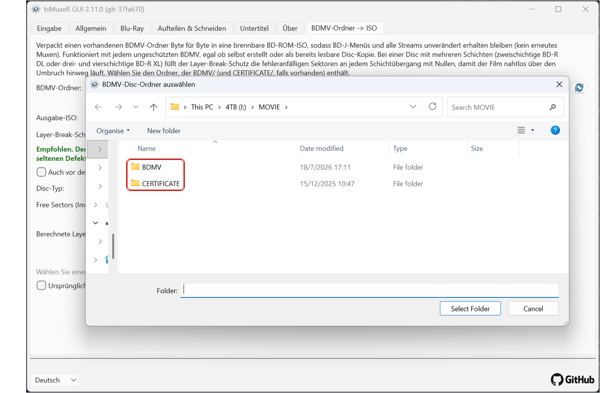

## Schritt 3: Den ausgefüllten Reiter prüfen

Sobald der Ordner gewählt ist, füllt sich der Reiter von selbst:

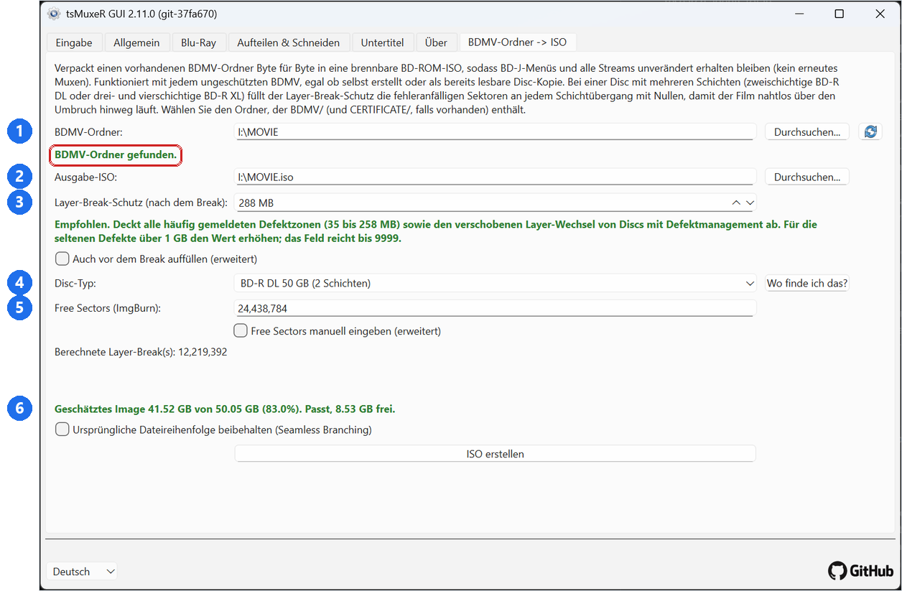

1. Der gewählte Ordner, bestätigt durch die grüne Meldung `BDMV-Ordner gefunden`.
2. Die Ausgabe-ISO. Sie wird automatisch neben den Quellordner gelegt; mit `Durchsuchen` lässt sich das ändern.
3. Der Layer-Break-Schutz, voreingestellt auf die empfohlenen 288 MB (dazu unten mehr).
4. Der Disc-Typ, den Sie brennen wollen.
5. Die Free Sectors des Rohlings und darunter die berechnete Position des Layer-Breaks.
6. Die Größenabschätzung: wie groß das Image wird, ob es auf den gewählten Disc-Typ passt und wie viel Platz übrig bleibt. Dieselbe Zeile warnt auch, wenn der Inhalt nicht passt.

Wenn alles stimmt, können Sie direkt auf `ISO erstellen` gehen. Die folgenden Abschnitte erklären die einzelnen Einstellungen.

## Der Disc-Typ

Wählen Sie die Disc, die Sie tatsächlich brennen. Die Auswahl legt die Kapazität fest und damit auch, wie viele Schichtübergänge geschützt werden müssen: einer bei einer zweischichtigen Disc, zwei bei einer dreischichtigen, drei bei einer vierschichtigen.

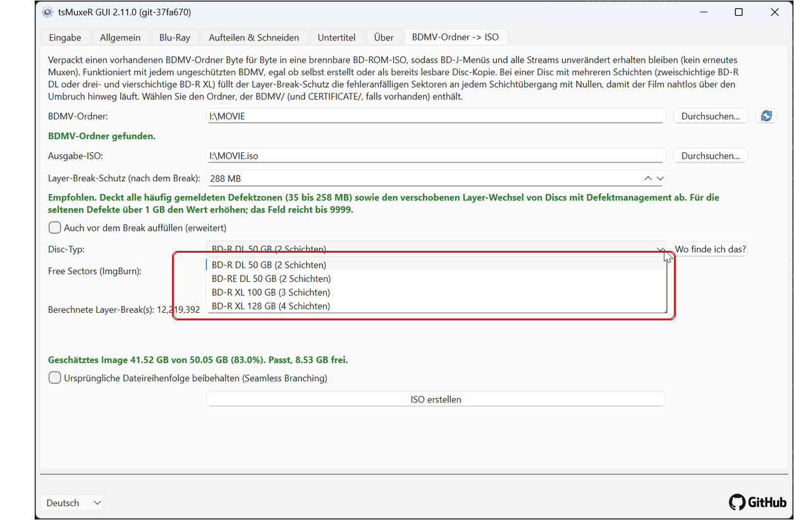

## Free Sectors

Bei einem üblichen Rohling wird das Feld für Sie ausgefüllt und bleibt gesperrt. Meldet Ihr Brennprogramm für Ihre konkrete Disc einen anderen Wert, setzen Sie den Haken bei `Free Sectors manuell eingeben (erweitert)` und tragen die Zahl ein; der berechnete Layer-Break aktualisiert sich sofort. Die Schaltfläche `Wo finde ich das?` erklärt, wo ImgBurn den Wert anzeigt.

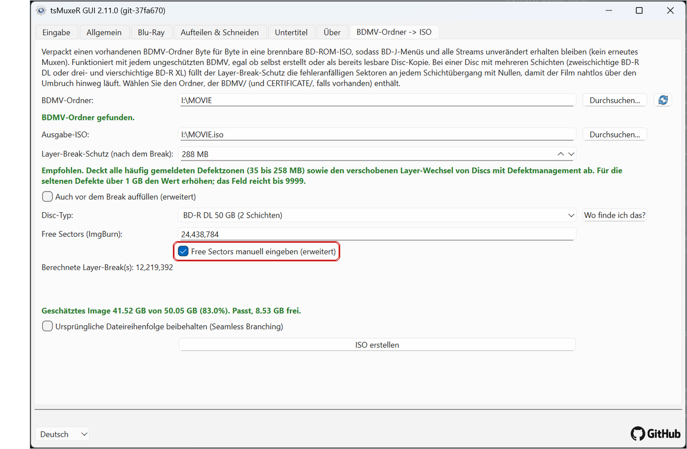

## Der Layer-Break-Schutz

Der Schutz ist die Menge an Nullen, die hinter jedem Layer-Break eingefügt wird, damit der Schichtwechsel nicht mitten in Ihren Filmdaten liegt. Die Voreinstellung von 288 MB ist der empfohlene Wert: Sie deckt alle häufig gemeldeten Defektzonen (35 bis 258 MB) und den verschobenen Layer-Wechsel von Discs mit Defektmanagement ab.

Sie können den Wert senken, aber der Hinweis unter dem Feld sagt Ihnen, was Sie dafür aufgeben. Bei 100 MB wird er orange: typische Defekte sind abgedeckt, größere defekte Zonen auf echten Medien aber nicht.

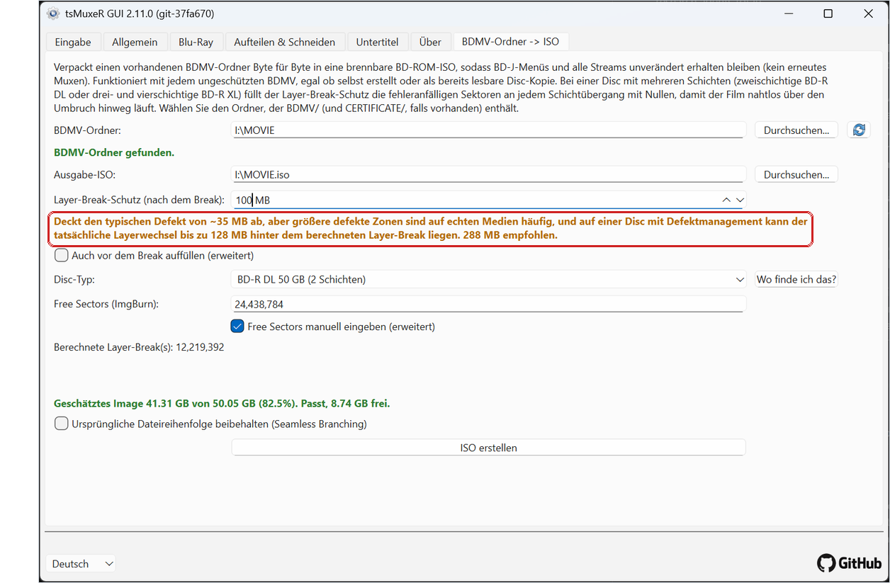

Unterhalb von etwa 35 MB wird er rot: Das Video kann dann auf Sektoren landen, die auf echter Hardware nachweislich versagen.

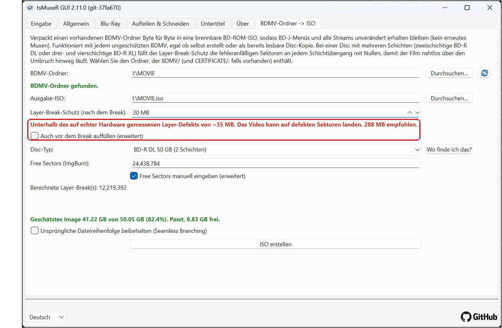

Im Zweifel lassen Sie die 288 MB stehen. Für die seltenen Defekte jenseits von 1 GB reicht das Feld bis 9999.

## Erweiterte Einstellungen

`Auch vor dem Break auffüllen` legt eine zweite, kleinere Schutzzone vor den Break (voreingestellt 4 MB). Die normale Schutzzone ist bewusst asymmetrisch, weil die meisten Defekte am Anfang der nächsten Schicht liegen; schalten Sie das nur für Medien ein, die auch kurz vor dem Break versagen.

`Ursprüngliche Dateireihenfolge beibehalten (Seamless Branching)` verhindert, dass die Dateien umsortiert werden. Normalerweise wird die größte Datei zuerst abgelegt, was der Schutzzone die beste Position verschafft. Setzt Ihre Disc dagegen auf Seamless Branching, wo die Stream-Dateien in ihrer ursprünglichen Reihenfolge bleiben müssen, setzen Sie hier den Haken.

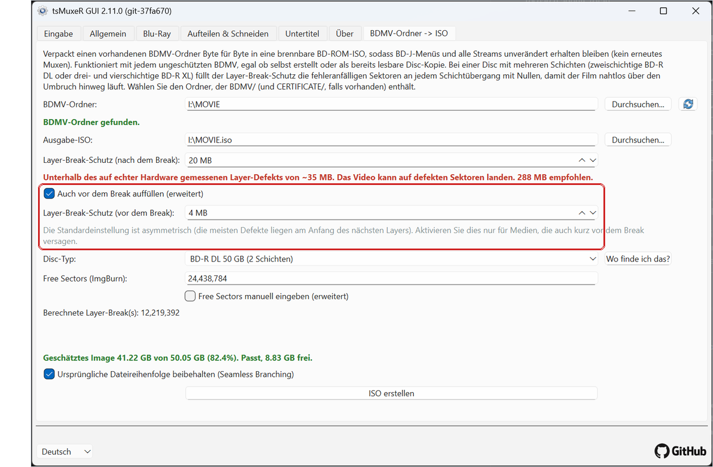

## Eine Disc oder eingebundene ISO als Quelle

Sie können den Reiter direkt auf ein Laufwerk oder eine eingebundene ISO richten (hier `J:`). Die blaue Meldung erinnert daran, dass die Quelle nur lesbar ist; die Ausgabe-ISO landet deshalb auf einem beschreibbaren Laufwerk.

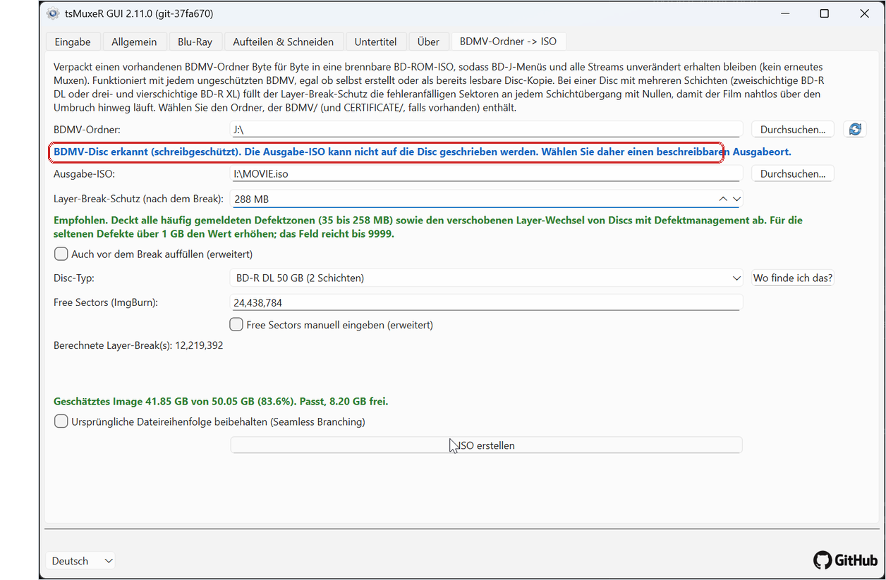

## Das Erstellen

Klicken Sie auf `ISO erstellen`. Das Fortschrittsfenster zeigt den Prozentwert und das tsMuxeR-Protokoll, darin auch die verwendeten Schutzeinstellungen.

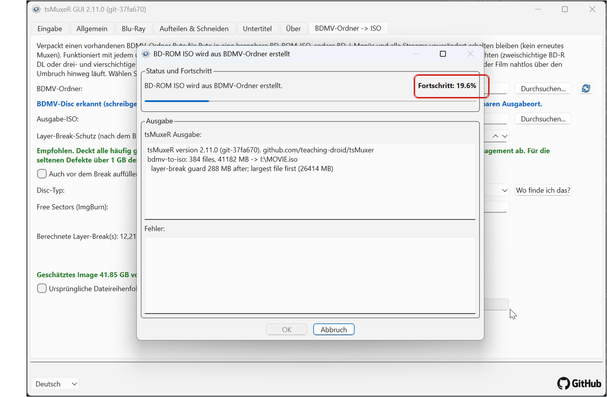

## Den Abschlussbericht lesen

Am Ende des Durchlaufs steht im Protokoll der Layer-Break-Bericht:

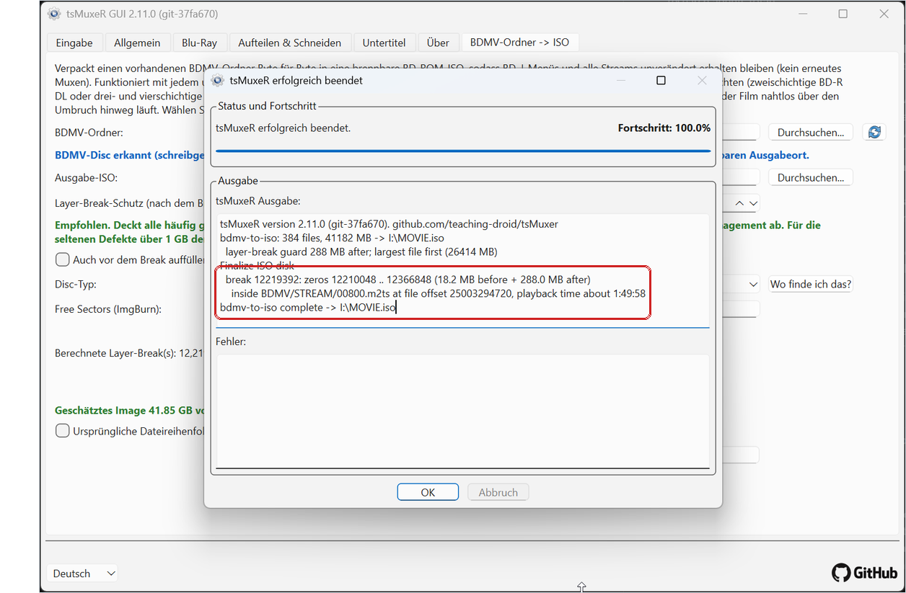

Er nennt für jeden Break:

* den Break-Sektor und den genauen Bereich der Nullfüllung darum herum,
* in welche Stream-Datei der Break fällt, und
* die **Abspielzeit** dieser Stelle, hier etwa 1:49:58.

Die Abspielzeit ist der nützliche Teil: Genau dort wechselt der Player auf die nächste Schicht. Wenn Sie eine gebrannte Disc prüfen wollen, springen Sie an diese Zeit und sehen sich den Übergang an; er sollte ohne sichtbare Pause durchlaufen.

## Die layerbreak-Textdatei

Neben der ISO wird eine kleine Textdatei angelegt, benannt nach der ISO, zum Beispiel `MOVIE.iso.layerbreak.txt`. Sie enthält denselben Layer-Break-Bericht, sodass Sie Break-Position und Abspielzeit später nachschlagen können, ohne etwas neu zu erstellen. Wenn Sie die ISO für spätere Brennvorgänge aufheben, heben Sie die Textdatei mit auf.

## Das Brennen

Brennen Sie die ISO mit Ihrem gewohnten Brennprogramm (zum Beispiel ImgBurn). Besondere Einstellungen sind nicht nötig; der Layer-Break wurde bereits im Image gesetzt und geschützt. Nach dem Brennen können Sie mit der Abspielzeit aus dem Bericht den Schichtwechsel auf der fertigen Disc überprüfen.
