# BDMV-Ordner in eine brennbare ISO verwandeln

Diese Anleitung zeigt Schritt für Schritt, wie aus einem BDMV-Disc-Ordner eine BD-ROM-ISO wird, die sich gefahrlos auf mehrschichtige Medien brennen lässt. Sie entstand mit tsMuxeR GUI 2.11.0 und wurde bis 2.13 aktualisiert; die Bildschirmfotos zeigen genau das, was auch bei Ihnen zu sehen ist.

## Was dieser Reiter macht

Der Reiter `BDMV-Ordner -> ISO` verpackt einen vorhandenen BDMV-Disc-Ordner Byte für Byte in eine brennbare BD-ROM-ISO. BD-J-Menüs und alle Streams bleiben unverändert erhalten, es wird nichts neu gemuxt. Bei einer Disc mit mehreren Schichten (zweischichtige BD-R DL oder drei- und vierschichtige BD-R XL) füllt der Layer-Break-Schutz die fehleranfälligen Sektoren an jedem Schichtübergang mit Nullen. Der Film läuft dadurch nahtlos über den Umbruch hinweg, statt auf den schlechtesten Sektoren der Disc zu landen.

## Vorbereitung

Sie brauchen:

* einen BDMV-Disc-Ordner, also einen Ordner, der `BDMV` (und meistens `CERTIFICATE`) enthält. Er kann selbst erstellt oder die Kopie einer bereits lesbaren Disc sein.
* einen Rohling im Blick (BD-R DL, BD-RE DL oder BD-R XL), damit Sie den passenden Disc-Typ wählen können.

## Schritt 1: Reiter öffnen

Starten Sie die tsMuxeR GUI und wechseln Sie auf den Reiter `BDMV-Ordner -> ISO`. Der Text oben fasst zusammen, was der Reiter tut.

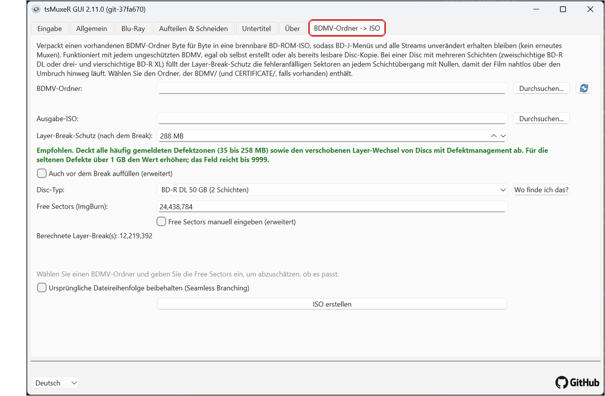

## Schritt 2: Disc-Ordner auswählen

Klicken Sie neben `BDMV-Ordner` auf `Durchsuchen` und wählen Sie den Ordner, der `BDMV` und `CERTIFICATE` **enthält**, nicht den Ordner `BDMV` selbst.

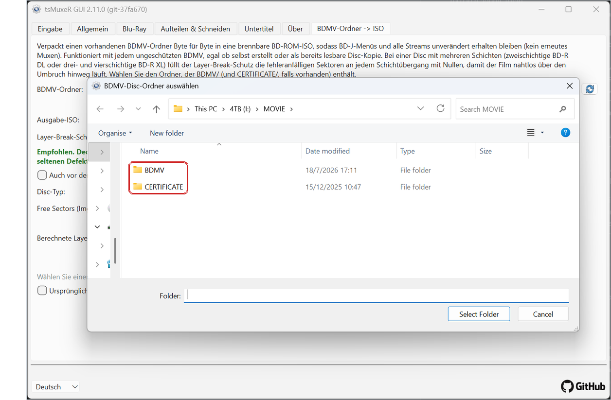

## Schritt 3: Den ausgefüllten Reiter prüfen

Sobald der Ordner gewählt ist, füllt sich der Reiter von selbst:

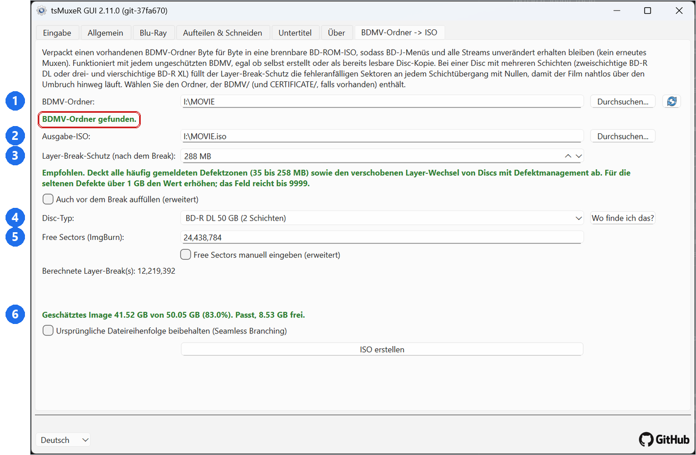

1. Der gewählte Ordner, bestätigt durch die grüne Meldung `BDMV-Ordner gefunden`.
2. Die Ausgabe-ISO. Sie wird automatisch neben den Quellordner gelegt; mit `Durchsuchen` lässt sich das ändern.
3. Der Layer-Break-Schutz, voreingestellt auf die empfohlenen 288 MB (dazu unten mehr).
4. Der Disc-Typ, den Sie brennen wollen.
5. Die Free Sectors des Rohlings und darunter die berechnete Position des Layer-Breaks.
6. Die Größenabschätzung: wie groß das Image wird, ob es auf den gewählten Disc-Typ passt und wie viel Platz übrig bleibt. Dieselbe Zeile warnt auch, wenn der Inhalt nicht passt. Als Faustregel sollten es etwa 90 Prozent oder weniger sein (siehe "Wie voll die Disc werden sollte" weiter unten).

Wenn alles stimmt, können Sie direkt auf `ISO erstellen` gehen. Die folgenden Abschnitte erklären die einzelnen Einstellungen.

## Der Disc-Typ

Wählen Sie die Disc, die Sie tatsächlich brennen. Die Auswahl legt die Kapazität fest und damit auch, wie viele Schichtübergänge geschützt werden müssen: einer bei einer zweischichtigen Disc, zwei bei einer dreischichtigen, drei bei einer vierschichtigen.

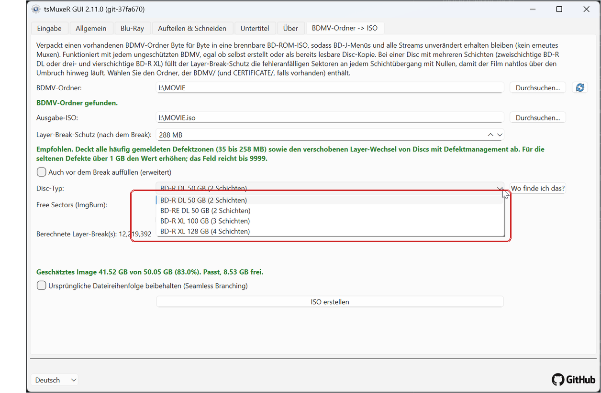

## Free Sectors

Bei einem üblichen Rohling wird das Feld für Sie ausgefüllt und bleibt gesperrt. Meldet Ihr Brennprogramm für Ihre konkrete Disc einen anderen Wert, setzen Sie den Haken bei `Free Sectors manuell eingeben (erweitert)` und tragen die Zahl ein; der berechnete Layer-Break aktualisiert sich sofort.

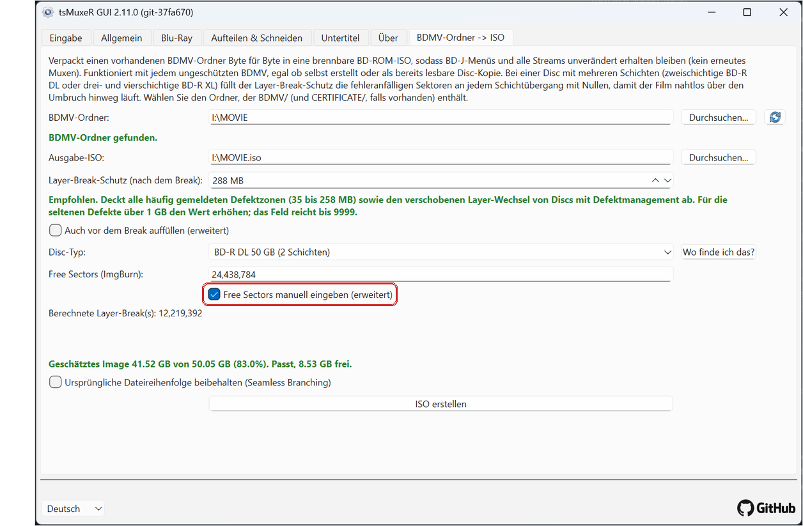

### Wo Sie den Free-Sectors-Wert in ImgBurn finden

**Hinweis:** ImgBurn ist eigenständige Software von Dritten und weder Teil von tsMuxeR noch mit diesem Projekt verbunden, von ihm empfohlen oder betreut. Es dient hier nur als weit verbreitetes Beispiel; jedes vergleichbare Brennprogramm, das die Free Sectors der Disc anzeigt, ist ebenso geeignet.

Die Schaltfläche `Wo finde ich das?` neben dem Feld öffnet diese Erklärung. Starten Sie ImgBurn und wählen Sie **Write image file to disc**:

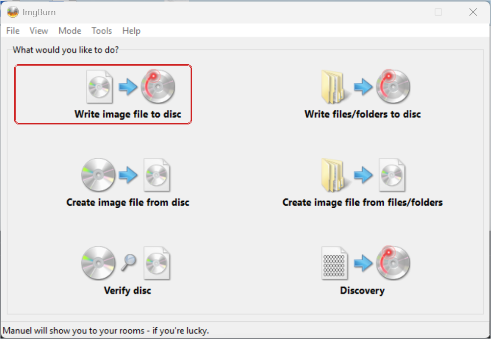

Legen Sie den Rohling ins Laufwerk. Das Disc-Informationsfeld rechts nennt **Free Sectors**; das ist die Zahl, die Sie eintragen:

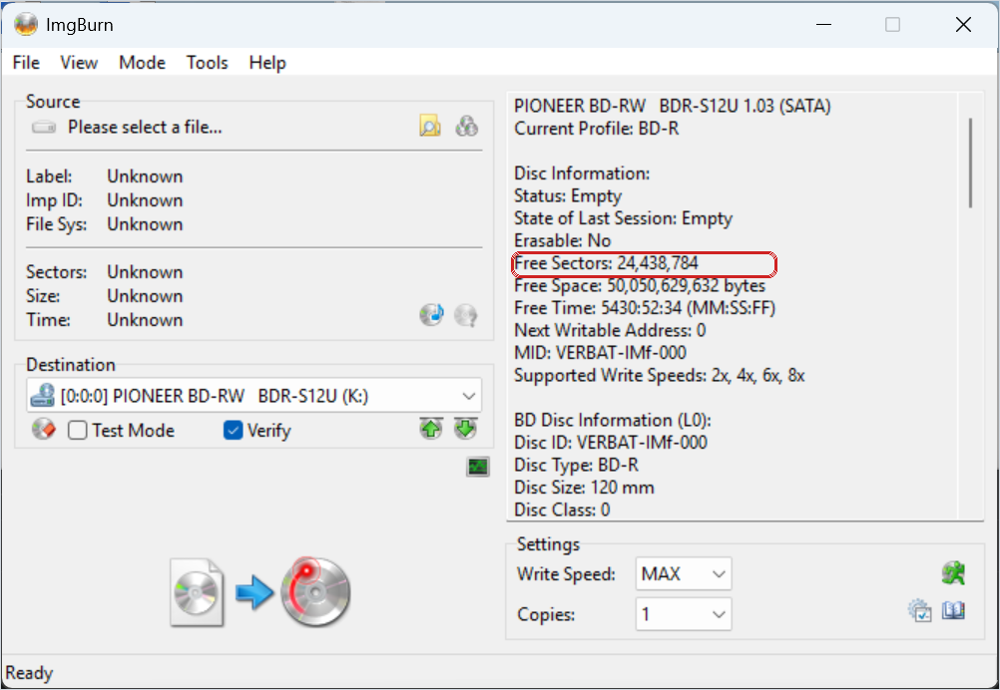

Verwenden Sie den Wert bei Free Sectors selbst, nicht Free Space (der in Bytes steht) oder eine Sektorenzahl aus einem anderen Programm; nur Free Sectors ist die volle formatierte Kapazität der Disc.

## Wie voll die Disc werden sollte

Füllen Sie die Disc möglichst nur zu etwa 90 Prozent, nicht bis zum Rand. Optische Medien werden von innen nach außen beschrieben, und die äußersten Sektoren, die zuletzt und am schnellsten geschrieben werden, haben die schlechteste Brennqualität; dort treten Lesefehler zuerst auf. Wenn der Brennvorgang bei etwa 90 Prozent bleibt, hält er Ihren Film von dieser schlechtesten Zone fern.

Die Größenabschätzung macht das leicht ablesbar: im Beispiel oben füllt das Image 83 Prozent der Disc, bequem unter 90. Steigt der Wert über 90 Prozent, nehmen Sie den nächstgrößeren Disc-Typ.

## Der Layer-Break-Schutz

Der Schutz ist die Menge an Nullen, die hinter jedem Layer-Break eingefügt wird, damit der Schichtwechsel nicht mitten in Ihren Filmdaten liegt. Die Voreinstellung von 288 MB ist der empfohlene Wert: Sie deckt alle häufig gemeldeten Defektzonen (35 bis 258 MB) und den verschobenen Layer-Wechsel von Discs mit Defektmanagement ab.

Sie können den Wert senken, aber der Hinweis unter dem Feld sagt Ihnen, was Sie dafür aufgeben. Bei 100 MB wird er orange: typische Defekte sind abgedeckt, größere defekte Zonen auf echten Medien aber nicht.

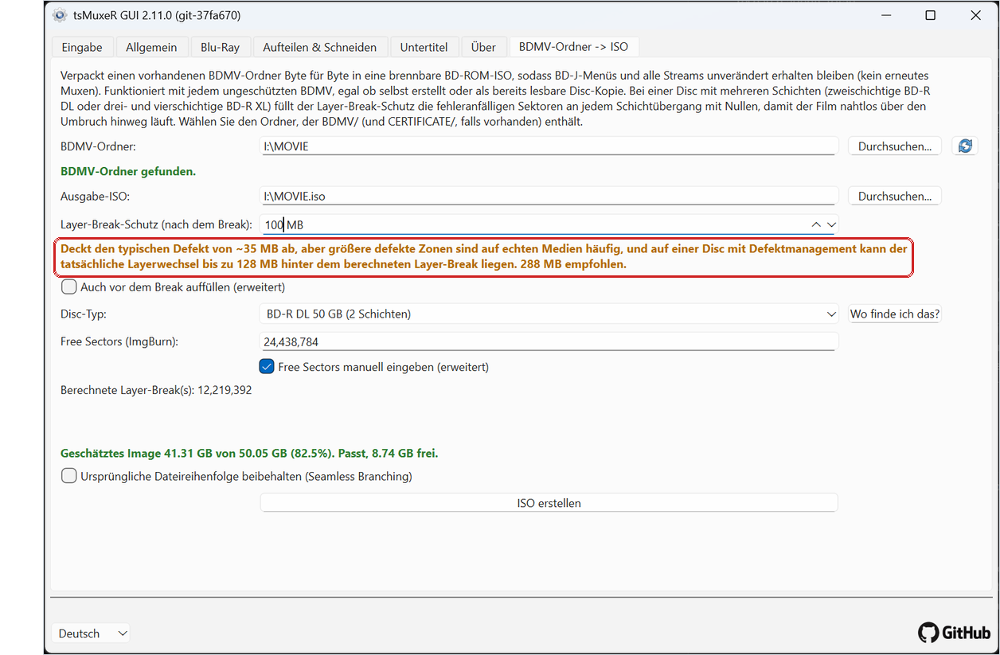

Unterhalb von etwa 35 MB wird er rot: Das Video kann dann auf Sektoren landen, die auf echter Hardware nachweislich versagen.

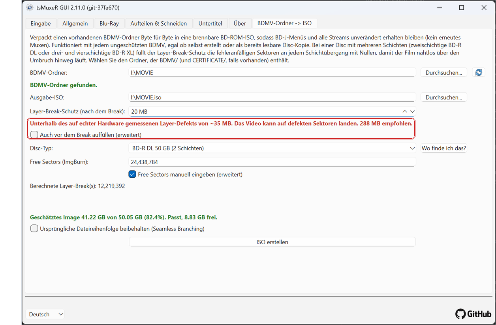

Im Zweifel lassen Sie die 288 MB stehen. Für die seltenen Defekte jenseits von 1 GB reicht das Feld bis 9999.

## Den Film vom äußeren Rand fernhalten (nur innen)

Der äußere Rand einer optischen Disc ist der Teil, der sich am schwersten sauber brennen lässt: Er wird zuletzt und am schnellsten beschrieben, und dort treten Lesefehler zuerst auf. Das Kontrollkästchen `Daten im inneren Disc-Bereich halten (den äußeren Rand auffüllen)` packt den ganzen Film auf die inneren Spuren jeder Schicht und füllt den äußeren Bereich mit Nullen, sodass nichts Wichtiges auf diesem schwachen äußeren Rand landet.

Wenn Sie es anhaken:

* tsMuxeR bemisst den Schutz automatisch nach Disc-Typ und Inhaltsmenge und füllt das Image auf die volle Disc auf. Deshalb werden das Feld `Layer-Break-Schutz` und die erweiterte Option `Auch vor dem Break auffüllen` ausgegraut (beide oben rot umrandet). Es ist nichts von Hand einzustellen.
* Der Film läuft weiterhin nahtlos über den Layer-Break, genau wie beim festen Schutz; die Nullfüllung wandert nur an den äußeren Rand, statt in einem Band direkt hinter dem Break zu liegen.

Nutzen Sie es, wenn Ihnen der robusteste mögliche Brennvorgang am wichtigsten ist und es Ihnen nichts ausmacht, dass das Image die ganze Disc füllt. Lassen Sie es aus, wenn Sie das Image lieber klein halten und den Schutz selbst festlegen möchten. Geprüft auf zweischichtiger BD-R DL: Eine Disc, die mit einem 41 MB großen, nicht korrigierbaren Defekt genau am Schichtübergang verifizierte, spielte den Film dennoch fehlerfrei ab, weil der Defekt in das Nullband fiel. Angeregt von DreckSoft.

## Erweiterte Einstellungen

`Auch vor dem Break auffüllen` legt eine zweite, kleinere Schutzzone vor den Break (voreingestellt 4 MB). Die normale Schutzzone ist bewusst asymmetrisch, weil die meisten Defekte am Anfang der nächsten Schicht liegen; schalten Sie das nur für Medien ein, die auch kurz vor dem Break versagen.

`Ursprüngliche Dateireihenfolge beibehalten (Seamless Branching)` verhindert, dass die Dateien umsortiert werden. Normalerweise wird die größte Datei zuerst abgelegt, was der Schutzzone die beste Position verschafft. Setzt Ihre Disc dagegen auf Seamless Branching, wo die Stream-Dateien in ihrer ursprünglichen Reihenfolge bleiben müssen, setzen Sie hier den Haken.

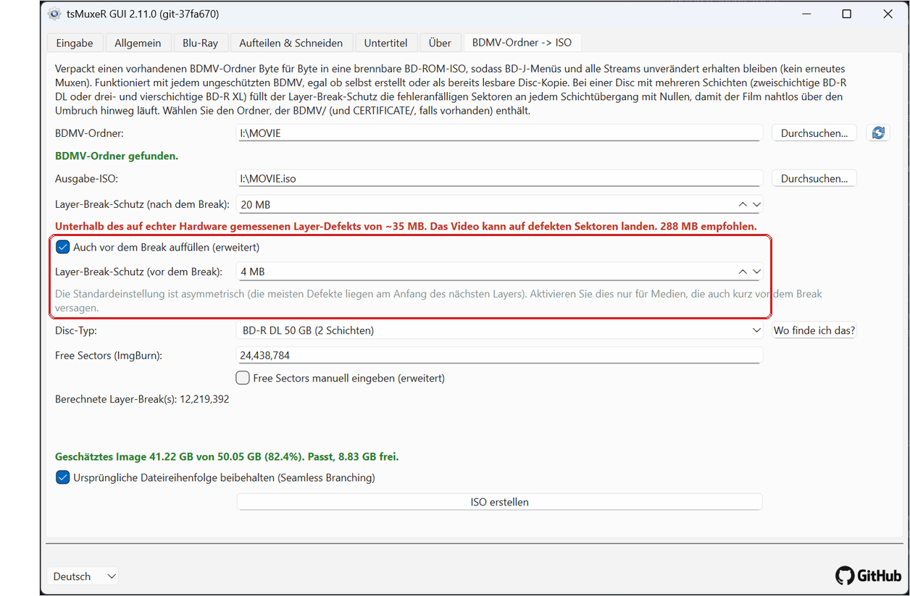

## Datenträgerbezeichnung und einbezogene Dateien

Unten im Reiter sitzen zwei weitere Optionen:

* `Datenträgerbezeichnung (optional)`: die Volume-Bezeichnung, die in die ISO geschrieben wird. Leer lassen behält das bisherige Verhalten bei.
* `Alle Dateien aus dem Ordner einschließen (nicht nur BDMV)`: Standardmäßig enthält das Image die Disc-Struktur-Ordner (`BDMV`, `CERTIFICATE`, `AACS`). Mit diesem Haken kommen auch alle übrigen Dateien und Ordner neben `BDMV` hinzu, etwa Readme-Dateien oder Cover-Bilder.
* `3D-Disc: Video einmal speichern, nicht zweimal`: Eine 3D-Disc hält ihr Video einmal unter drei Namen; die `.ssif` und die beiden `.m2ts` sind dieselben Sektoren, dreifach betrachtet. Werden alle drei über ihren Namen kopiert, landet es zweimal im Abbild und dieses wird etwa doppelt so groß, sodass eine 3D-Disc von einer BD50 nicht mehr auf eine BD50 passt. Mit diesem Haken wird es einmal gespeichert, so wie die Quelldisc es hält. Bei einer 2D-Disc ohne Wirkung.

So oder so vervollständigt tsMuxeR für Sie die komplette Standard-Blu-ray-Ordnerstruktur: die leeren Ordner `AUXDATA`, `BDJO`, `JAR` und `META`, einen `CERTIFICATE`-Ordner und ein `BACKUP` mit Kopien von `index.bdmv`, `MovieObject.bdmv` sowie den Dateien aus `PLAYLIST`/`CLIPINF`, dieselbe Struktur, die tsMuxeR auch beim Erstellen einer Disc anlegt. Nur was der Quelle fehlt, wird ergänzt, und die großen `.m2ts`-Streams werden nie doppelt abgelegt. So sind Player, die das vollständige Layout erwarten, zufrieden, ohne dass das Image aufgebläht wird.

## Eine Disc oder eingebundene ISO als Quelle

Sie können den Reiter direkt auf ein Laufwerk oder eine eingebundene ISO richten (hier `J:`). Die blaue Meldung erinnert daran, dass die Quelle nur lesbar ist; die Ausgabe-ISO landet deshalb auf einem beschreibbaren Laufwerk.

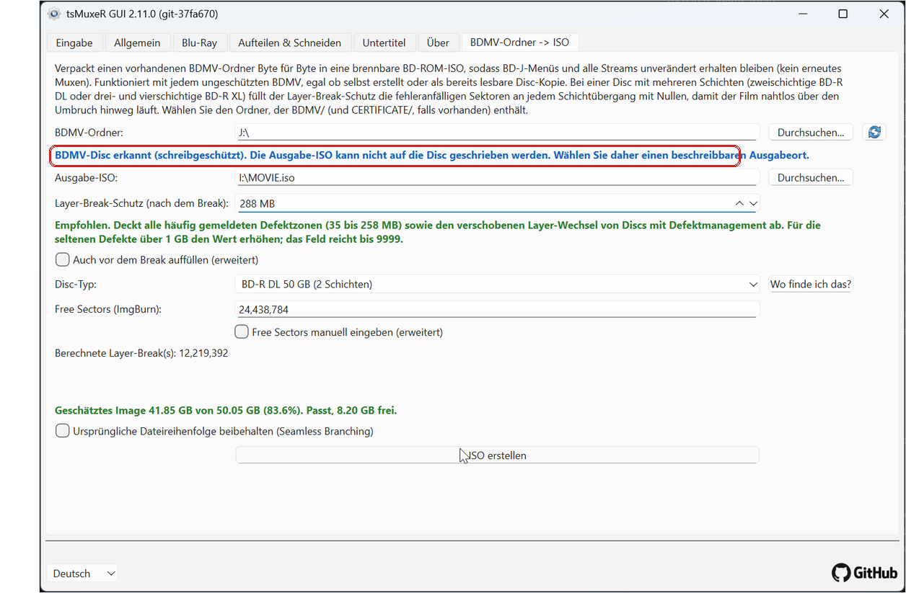

## Das Erstellen

Klicken Sie auf `ISO erstellen`. Das Fortschrittsfenster zeigt den Prozentwert und das tsMuxeR-Protokoll, darin auch die verwendeten Schutzeinstellungen.

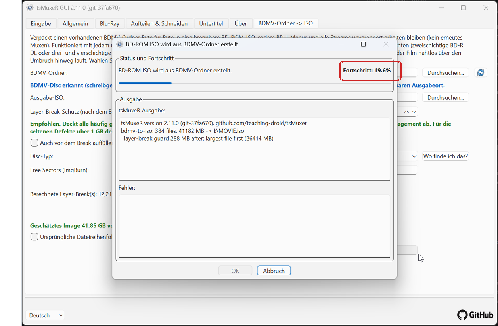

## Den Abschlussbericht lesen

Am Ende des Durchlaufs steht im Protokoll der Layer-Break-Bericht:

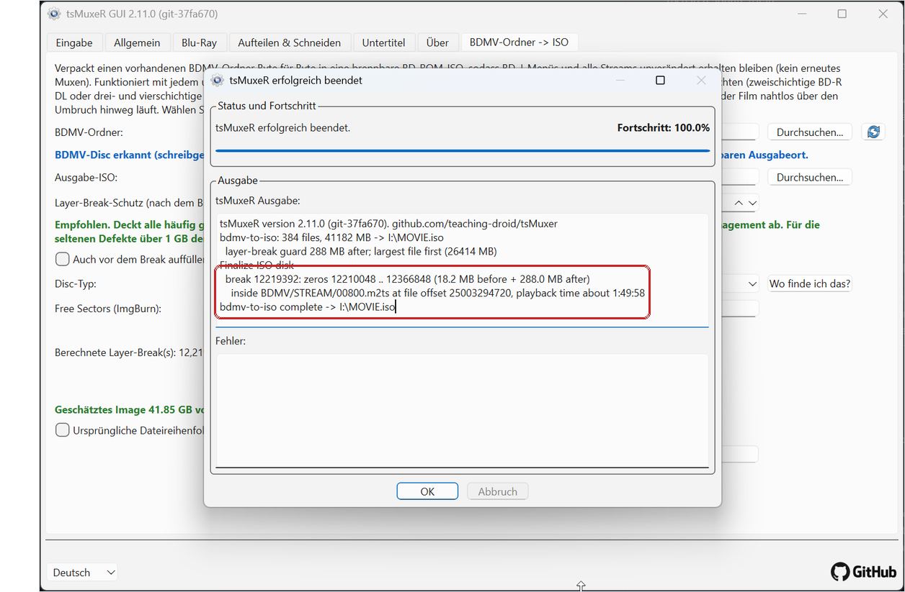

Er nennt für jeden Break:

* den Break-Sektor und den genauen Bereich der Nullfüllung darum herum,
* in welche Stream-Datei der Break fällt, und
* die **Abspielzeit** dieser Stelle, hier etwa 1:49:58.

Die Abspielzeit ist der nützliche Teil: Genau dort wechselt der Player auf die nächste Schicht. Wenn Sie eine gebrannte Disc prüfen wollen, springen Sie an diese Zeit und sehen sich den Übergang an; er sollte ohne sichtbare Pause durchlaufen.

## Die layerbreak-Textdatei

Neben der ISO wird eine kleine Textdatei angelegt, benannt nach der ISO, zum Beispiel `MOVIE.iso.layerbreak.txt`. Sie enthält denselben Layer-Break-Bericht, sodass Sie Break-Position und Abspielzeit später nachschlagen können, ohne etwas neu zu erstellen. Wenn Sie die ISO für spätere Brennvorgänge aufheben, heben Sie die Textdatei mit auf.

## Wie viel Speicherplatz die ISO belegt

Der Layer-Break-Schutz und die Nur-innen-Füllung werden als sparse-Bereich gespeichert: Die Nullen werden als leeres Loch in der Datei vermerkt, statt als gigabyteweise echte Null-Bytes auf der Platte. Die `.iso` auf Ihrer Festplatte kann daher viel kleiner sein als die Disc, die sie darstellt; ein Nur-innen-Image, das auf eine volle 50-GB-BD-R-DL aufgefüllt ist, belegt unter Umständen nur etwa die Größe des Films selbst, weil die gesamte Randfüllung keinen Speicherplatz kostet.

Am Brennen ändert das nichts. Beim Schreiben der ISO legt das Laufwerk weiterhin die komplette Disc an, Nullen und alles, Byte für Byte identisch mit einem nicht-sparse Image; der Brennvorgang dauert also die volle Zeit für die Disc-Größe. Die sparse-Datei spart nur Platz auf Ihrer Festplatte und lässt die Erstellung früher fertig werden; sie macht die Disc weder kleiner noch schneller zu brennen.

Wenn Sie die ISO auf ein Laufwerk oder Dateisystem kopieren, das keine sparse-Dateien unterstützt, wächst sie dort auf ihre volle Größe an. Das ist normal, und die Disc, die daraus entsteht, ist in beiden Fällen dieselbe.

## Das Brennen

Brennen Sie die ISO mit Ihrem gewohnten Brennprogramm (zum Beispiel ImgBurn). Besondere Einstellungen sind nicht nötig; der Layer-Break wurde bereits im Image gesetzt und geschützt. Nach dem Brennen können Sie mit der Abspielzeit aus dem Bericht den Schichtwechsel auf der fertigen Disc überprüfen.
